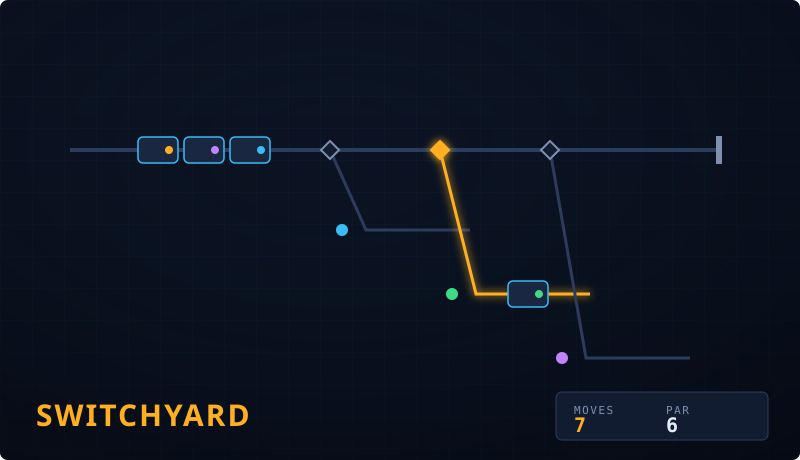

# Switchyard

**▶ Live demo: [apps.charliekrug.com/switchyard](https://apps.charliekrug.com/switchyard/)**

[](https://github.com/ctkrug/switchyard/actions/workflows/ci.yml)
[](LICENSE)

A fresh train shunting puzzle every time. Route every car to its correct
siding in the fewest moves: pull the levers, watch the whole train reroute,
and listen for the couplings click home.



## Who it's for

Puzzle players who've solved every level of Rush Hour, Sokoban, or the usual
20-level browser puzzle pack and hit the wall where there's nothing left but
replaying old boards. Switchyard never runs out: each yard is generated the
moment you load it, so the puzzle is always new and always yours.

## What it is

Switchyard is a browser puzzle game built on HTML5 Canvas. Each level is a
small rail yard: a train of mixed cars waits on the lead track, and a row of
sidings each need a specific car delivered. You throw switches to steer the
front car onto the right siding, shunting the train down the line one move at
a time. Clear the yard in as few moves as possible, then send yourself to the
next one.

Every yard is built by a generator that runs its own solver against the
layout before you ever see it, so a solution always exists and the game can
tell you the **par** (the shortest possible number of moves) to beat.

## Features

- **Endless, always-solvable yards.** A constraint generator builds the track
  and the car manifest together, then a breadth-first solver verifies a
  solution exists and computes par before the yard is shown. No unfair or
  unsolvable boards, ever.
- **Beat par.** Every yard reports the solver's own shortest plan; your live
  move count is measured against it, and your best result versus par persists
  across sessions.
- **Tweened shunting.** Throwing a switch eases the affected car along the
  track and couples it into its siding with a pulse, a brief board shake, and
  a coupling sound. Never an instant teleport.
- **Undo and reset.** Experiment freely; a misclick never costs you the run.
- **Synthesized sound.** Every switch throw, coupling, and win is scored with
  WebAudio-generated tones (zero audio files). The mute toggle sticks across
  reloads.
- **A win worth earning.** Clearing a yard bursts confetti, plays a fanfare,
  and offers a downloadable results card with your moves, par, and rating.
- **Plays on a phone.** The board is the hero at any width, switch levers are
  44px touch targets, and motion respects `prefers-reduced-motion`.

## How to play

1. Cars queue on the lead track, front car first. Each siding wants one
   specific car (matched by the colored chip).
2. A switch thrown **right** diverts the front car into that switch's siding;
   left keeps it running down the lead.
3. Set the switches so the front car lands on its siding, then keep going. One
   throw moves at most one car.
4. Send every car home in as few moves as you can, and try to hit par.

## Stack

- **TypeScript** for the game logic, the yard generator, and the solver.
- **HTML5 Canvas** (2D) for rendering, crisp at any resolution via
  `devicePixelRatio`-aware drawing.
- **Vite** for the dev server and the static production build.
- **Vitest** and **fast-check** for unit and property-based tests.
- No backend and no runtime dependencies. It ships as a static site.

## Development

```bash
npm install
npm run dev            # local dev server at http://localhost:5173
npm test               # run the test suite
npm run test:coverage  # test suite with a v8 coverage report
npm run build          # typecheck + static production build to site/
npm run lint           # typecheck only (no separate linter is configured)
```

The pure game core (`src/game/`) has no DOM or canvas dependency and carries
the deepest coverage. See [`docs/ARCHITECTURE.md`](docs/ARCHITECTURE.md) for a
map of the codebase, [`docs/VISION.md`](docs/VISION.md) for the design
rationale, and [`docs/DESIGN.md`](docs/DESIGN.md) for the art direction.

## License

MIT. See [LICENSE](LICENSE).

---

More of Charlie's projects → [apps.charliekrug.com](https://apps.charliekrug.com)
